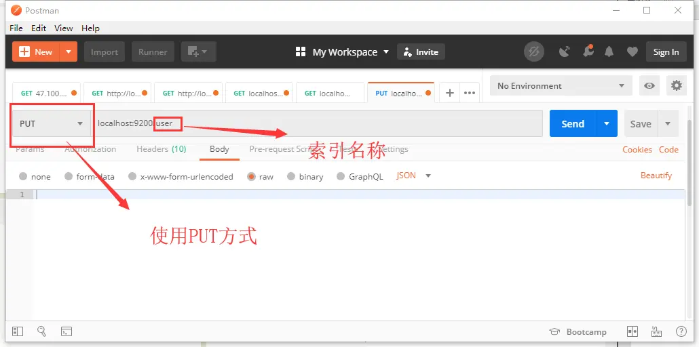
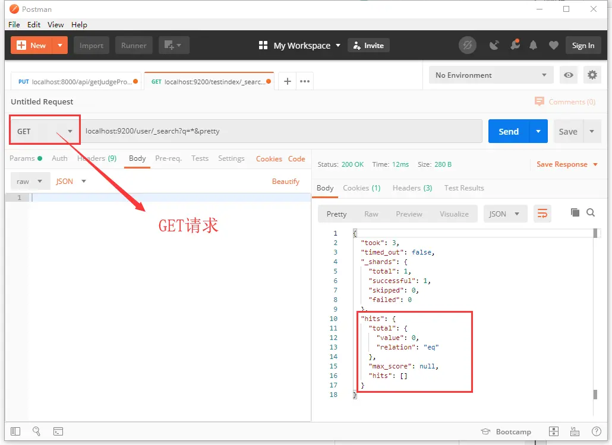
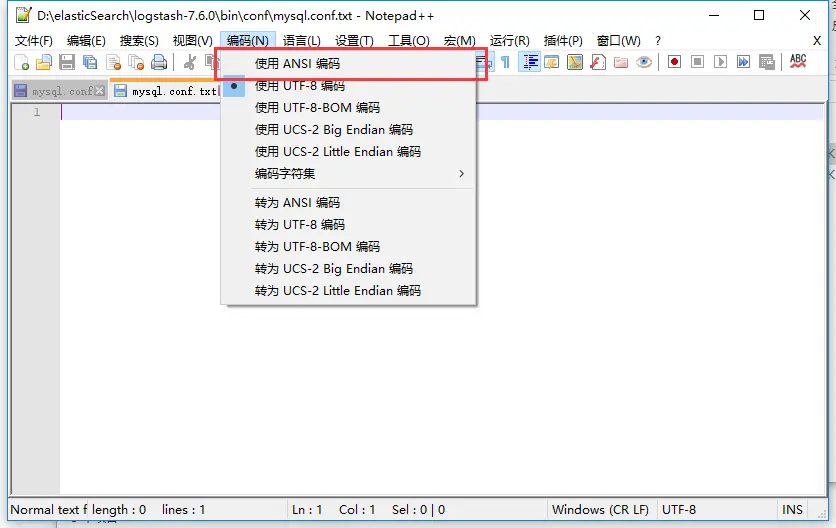
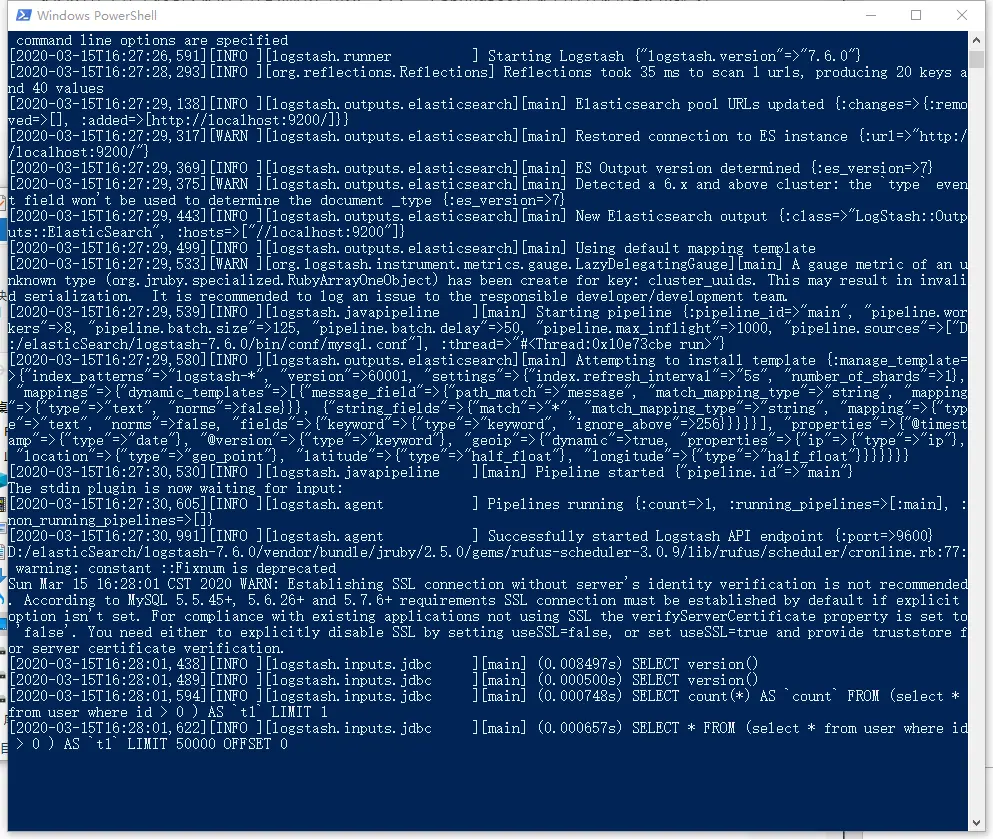
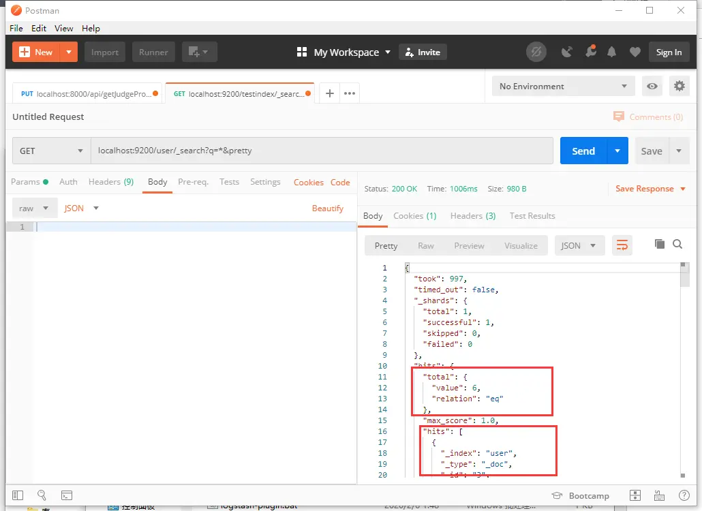
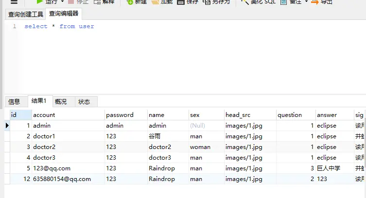

第二周了，今天我们来讲一下 Logstash 的使用。

  首先，我们打开 ES，使用 postman 新建一个索引 user，在 postman 里使用 PUT 方式向 localhost:9200/user 发送请求。看到返回信息：

```
{
    "acknowledged": true,
    "shards_acknowledged": true,
    "index": "user"
}
```



 这个时候我们看一下 user 索引里的数据，在 postman 里使用 get 方式，发送 localhost:9200/user/_search?q=*&pretty 查看 user 索引下的所有数据。可以看到，在 user 索引下，并没有任何数据。



我们要读取的表结构为：

```
CREATE TABLE `user` (

  `id` int(11) NOT NULL AUTO_INCREMENT,

  `account` varchar(40) DEFAULT NULL,

  `password` varchar(40) DEFAULT NULL,

  `name` varchar(20) DEFAULT NULL,

  `sex` varchar(15) DEFAULT NULL,

  `head_src` varchar(40) DEFAULT NULL,

  `question` int(11) DEFAULT NULL,

  `answer` varchar(100) DEFAULT NULL,

  `signature` varchar(40) DEFAULT NULL,

  `grade` int(11) DEFAULT NULL,

  `code` varchar(100) NOT NULL,

  `state` tinyint(1) unsigned zerofill NOT NULL,

  `permission` tinyint(1) DEFAULT NULL,

  `date` date DEFAULT NULL,

  PRIMARY KEY (`id`),

  UNIQUE KEY `account` (`account`)

) ENGINE=InnoDB AUTO_INCREMENT=13 DEFAULT CHARSET=utf8 STATS_PERSISTENT=1;
```

(大学里自己做的系统里的表，注释都没有，技术不过关啊)

  接下来，我们进入 Logstash 文件夹里，新建一个 ConnectionJar 文件夹，在这个文件夹里放入 mysql 连接的 jar 包，可以去 Maven 仓库里面去下一个，这里我就不放链接了。

  然后我们打开 Logstash 根目录下的 bin 文件夹，创建 conf 文件夹，在这个文件夹里，我们创建 mysql.conf 文件。打开 conf 文件，设置文件编码为 ANSI（非常重要！！非常重要！！非常重要！！）。



 配置文件的内容可以这么写： 

```
input {

    # 标准输入形式，暂时用不到

    stdin {

    }

    # JDBC设置

    jdbc {

    # 数据库连接

    jdbc_connection_string => "jdbc:mysql://localhost:3306/retina"

    jdbc_user => "root"

    jdbc_password => "123456"

    # Jar包的位置

    jdbc_driver_library => "D:\elasticSearch\logstash-7.6.0\ConnectionJar\mysql-connector-java-5.1.40-bin.jar"

    jdbc_driver_class => "com.mysql.jdbc.Driver"

 

    # 是否使用列数据

    use_column_value => true

    # 追踪的列，与use_column_value必须同时使用

    tracking_column => id

    # 是否开启记录最后一次运行数据

    record_last_run => true

    # 记录数据的保存位置

    last_run_metadata_path=>"D:\elasticSearch\logstash-7.6.0\bin\conf\station_parameter.txt"

    # 是否开启分页

    jdbc_paging_enabled => "true"

    # 分页数据大小

    jdbc_page_size => "50000"

    # SQL语句，也可以使用以下的文件形式

    # statement_filepath => "D:\elasticSearch\logstash-7.6.0\bin\conf\information.sql"

    statement => "select * from user where id > :sql_last_value "

    # 定时执行的时间，这个在我的一篇博客里提到https://my.oschina.net/u/4109273/blog/3042086

    schedule => "* * * * *"

    # 索引的名称

    type => "user"

  }

}

# 拦截器设置，本篇中没有用到，就不解释了

filter {}


# 输出配置

output {

    elasticsearch {

       # ES的地址

       hosts => "localhost:9200"

       # 使用的索引

       index => "user"

       # 文档使用的ID列

       document_id => "%{id}"

    }

}
```

但是！不能使用上面的配置，会报错的，因为文件里不能出现中文，所有我们要把所有的注释删掉！

但是！不能使用上面的配置，会报错的，因为文件里不能出现中文，所有我们要把所有的注释删掉！

但是！不能使用上面的配置，会报错的，因为文件里不能出现中文，所有我们要把所有的注释删掉！（可用的配置信息我写在最后）

然后我们在 bin 文件里打开 cmd，运行.\logstash -f .\conf\mysql.conf 命令。看到这样的截图，就说明 Logstash 已经在进行数据处理了。



然后我们看一下 user 索引下的数据，可以看到，数据已经写入了，再对比一下 user 表的数据，可以看到，所有的 user 数据已经写入 ES 了。至此，logstash 的基础使用已经可以了。





配置信息：

```
input {

    stdin {

    }

    jdbc {

    jdbc_connection_string => "jdbc:mysql://localhost:3306/retina"

    jdbc_user => "root"

    jdbc_password => "123456"

    jdbc_driver_library => "D:\elasticSearch\logstash-7.6.0\JDBC\mysql-connector-java-5.1.40-bin.jar"

    jdbc_driver_class => "com.mysql.jdbc.Driver"

 

    use_column_value => true

    tracking_column => id

    record_last_run => true

    last_run_metadata_path=>"D:\elasticSearch\logstash-7.6.0\bin\conf\station_parameter.txt"

    jdbc_paging_enabled => "true"

    jdbc_page_size => "50000"

    statement => "select * from user where id > :sql_last_value "

    schedule => "* * * * *"

    type => "user"

  }

}

filter {}


output {

    elasticsearch {

       hosts => "localhost:9200"

       index => "user"

       document_id => "%{id}"

    }

}
```

