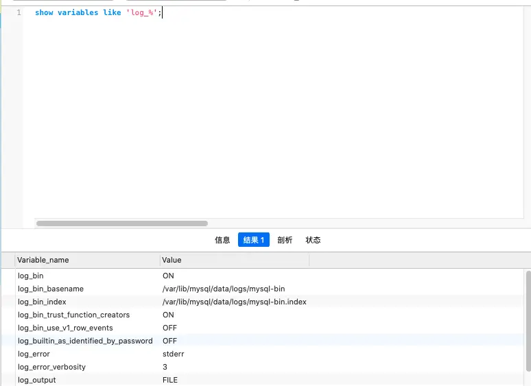
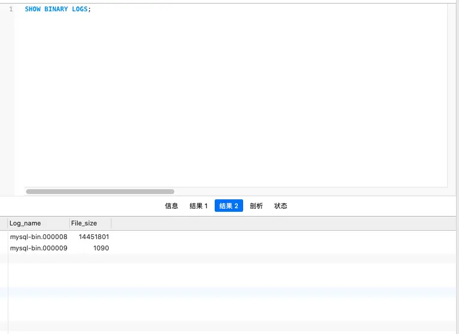
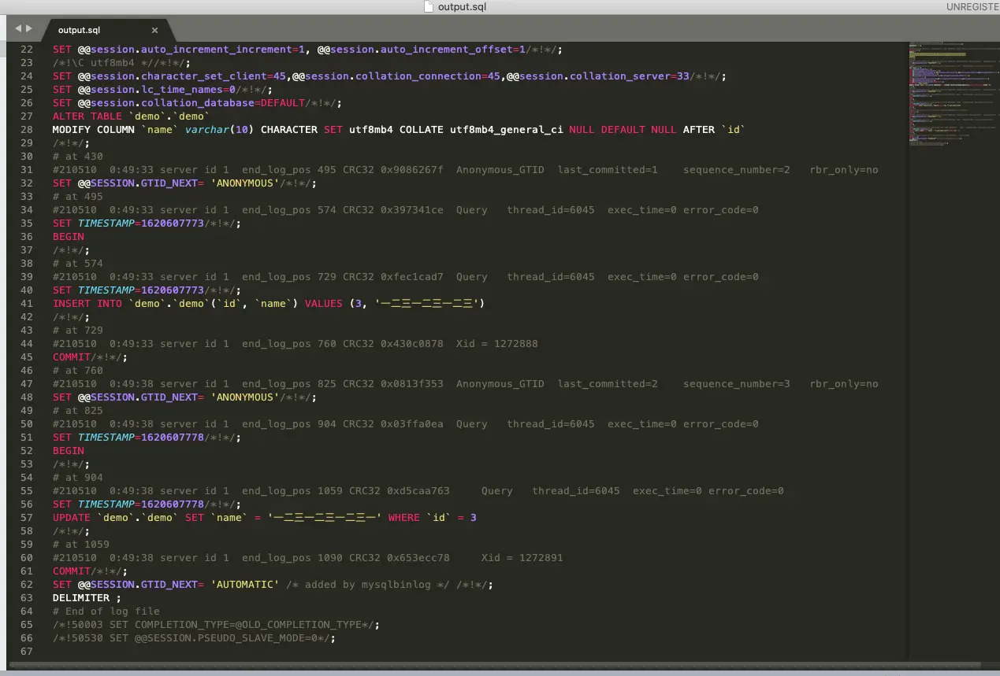

# [mysql binlog 开启、解析成 sql 语句](https://my.oschina.net/u/4109273/blog/5077873)

之前在测试环境的数据出问题了，但是 Java 程序的日志没有显示修改的 sql，我怀疑是有人直接修改了数据库，导致出问题了，所以打算查看 mysql 的 binlog 查看数据修改。后来发现是有人直接修改数据库的数据，导致数据不一致的情况，问题也和测试说明了，bug-1。因为现在关于 mysql 的 binlog 读取和解读的博客太少了 (我找了很久，最后才能看懂)，所以总结一下，帮助一下大家。公司环境不太方便展示，所以这里我用我自己的数据库 (mysql-5.7.31) 来举例。

​    1. 是否开启了 binlog

​     如果没有开启 binlog，那么接下来的一切都无从谈起。在输入行输入

```
show variables like 'log_%'
```

 如果 log_bin 是 ON 的话，说明日志已经开启。log_bin_basename 展示了 binlog 文件的基础名字，也可以知道 binlog 文件的位置在 /var/lib/mysql/data/logs/ 目录下。如果没有开启，可以搜索一下如何开启 binlog 日志记录。

​    2. 查看 binlog 文件的位置

​     运行 SHOW BINARY LOGS 查看 binlog 文件的位置。可以看到，现在数据库的 binlog 已经记录到 000009 了。打开服务器，查看一下目录下的文件，发现目标文件 mysql-bin.000009。



3. 输出 binlog 文件

​     在服务器上运行       

```
mysqlbinlog --start-datetime="2021-03-01 00:00:00" --stop-datetime="2021-06-21 23:59:59" /var/lib/mysql/data/logs/mysql-bin.000009 -r  /var/lib/mysql/data/logs/output.sql

```

​     --start-datetime 日志开始时间

​     --stop-datetime 日志结束时间

​     /var/lib/mysql/data/logs/output.sql 日志输出位置

​     下载 output.sql 文件到本地，查看 output.sql 文件。可以看到，在 output 文件中，已有 sql 信息了。

​     不过这种情况是 binlog 纪录为 statement 的格式，binlog 记录的格式有多种：statement、row、mixed。其中 mixed 其实是根据执行的语句，mysql 自动选择 statement 或 row 纪录。

